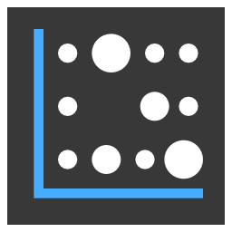

<!-- Improved compatibility of back to top link: See: https://github.com/othneildrew/Best-README-Template/pull/73 -->

<a name="readme-top"></a>

<br />
<div align="center">
  <a href="https://github.com/maslomeister/easyheatmap">
    
  </a>

  <h3 align="center">Easy heatmap</h3>

  <p align="center">
    Easily create beautiful heatmaps for your qmk keyboard
    <br />
    <a href="https://easyheatmap.netlify.app/">Website</a>
    ·
    <a href="https://github.com/maslomeister/easyheatmap/issues">Report Bug</a>
    ·
    <a href="https://github.com/maslomeister/easyheatmap/issues">Request Feature</a>
  </p>
</div>

<!-- ABOUT THE PROJECT -->

## About The Project

<!-- [![Product Name Screen Shot][product-screenshot]](https://example.com) -->

This tool will allow you to create heatmap for you qmk keyboard in a few easy steps, you can also customize the look of your heatmap very easily.

[![React][react.js]][react-url][![Vite][vite]][vite-url][![Redux][redux]][redux-url]

<!-- USAGE EXAMPLES -->

## Examples

![Example one][example1]
![Example two][example2]
![Example three][example3]

<!-- <p align="right">(<a href="#readme-top">back to top</a>)</p> -->

<!-- GETTING STARTED -->

## Local usage

```
Prerequisites:

node >= 18.7.0
npm >= 8.15.0
```

1. Clone the repo
   ```sh
   git clone https://github.com/your_username_/Project-Name.git
   ```
2. Install NPM packages
   ```sh
   npm install
   ```
3. Start local server
   ```js
   npm run dev
   ```

<!-- <p align="right">(<a href="#readme-top">back to top</a>)</p> -->

<!-- ROADMAP -->

## Roadmap

- [ ] Add settings page
  - [ ] import/export data
  - [ ] reset saved config
  - [ ] change image or key matrix
  - [ ] preview mapping data on image
  - [ ] create custom layer names
- [ ] Add drop down for layers selection
- [ ] Add settings page where one could view and change saved settings
- [ ] See the [open issues](https://github.com/maslomeister/easyheatmap/issues) for a full list of proposed features (and known issues).

<!-- <p align="right">(<a href="#readme-top">back to top</a>)</p> -->

<!-- CONTRIBUTING -->

## Contributing

Contributions are what make the open source community such an amazing place to learn, inspire, and create. Any contributions you make are **greatly appreciated**.

If you have a suggestion that would make this better, please fork the repo and create a pull request. You can also simply open an issue with the tag "enhancement".
Don't forget to give the project a star! Thanks again!

1. Fork the Project
2. Create your Feature Branch (`git checkout -b feature/AmazingFeature`)
3. Commit your Changes (`git commit -m 'Add some AmazingFeature'`)
4. Push to the Branch (`git push origin feature/AmazingFeature`)
5. Open a Pull Request

<!-- <p align="right">(<a href="#readme-top">back to top</a>)</p> -->

<!-- LICENSE -->

## License

Distributed under the MIT License. See `LICENSE.txt` for more information.

<!-- <p align="right">(<a href="#readme-top">back to top</a>)</p> -->

<!-- ACKNOWLEDGMENTS -->

## Acknowledgments

- [heatmap.js](https://www.patrick-wied.at/static/heatmapjs/)
- [Precondition](https://github.com/precondition/precondition.github.io)
- [Qmk heatmap generator](https://precondition.github.io/qmk-heatmap)

<p align="right">(<a href="#readme-top">back to top</a>)</p>

<!-- MARKDOWN LINKS & IMAGES -->

[example1]: https://github.com/maslomeister/easyheatmap/blob/master/images/examples/example1.png?raw=true
[example2]: https://github.com/maslomeister/easyheatmap/blob/master/images/examples/example2.png?raw=true
[example3]: https://github.com/maslomeister/easyheatmap/blob/master/images/examples/example3.png?raw=true
[license-shield]: https://img.shields.io/github/license/othneildrew/Best-README-Template.svg?style=for-the-badge
[license-url]: https://github.com/othneildrew/Best-README-Template/blob/master/LICENSE.txt
[linkedin-shield]: https://img.shields.io/badge/-LinkedIn-black.svg?style=for-the-badge&logo=linkedin&colorB=555
[linkedin-url]: https://linkedin.com/in/othneildrew
[product-screenshot]: images/screenshot.png
[redux]: https://img.shields.io/badge/Redux-593D88?style=for-the-badge&logo=redux&logoColor=white
[redux-url]: https://redux.js.org/
[vite]: https://img.shields.io/badge/vite-%23646CFF.svg?style=for-the-badge&logo=vite&logoColor=white
[vite-url]: https://vitejs.dev/
[react.js]: https://img.shields.io/badge/React-20232A?style=for-the-badge&logo=react&logoColor=61DAFB
[react-url]: https://reactjs.org/
